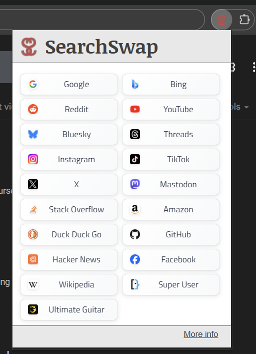

## Installation
Currently support Microsoft Edge and Google Chrome. I'll consider adding support for Mozilla Firefox based on demand. 
* Install for Microsoft Edge (coming soon)
* Install for Google Chrome (coming soon)

## Overview
SearchSwap is a browser extension that makes it really quick and easy to hop around different search engines and sites. E.g., imagine you're searching for something on Google but want to do the same search on Bing or Amazon. All you have to do is click on the SearchSwap extension icon on the browser's toolbar and then click on Bing, Amazon, or any of the other supported sites. 





If you installed it but don't see SearchSwap on your toolbar, try clicking on the puzzle piece icon (the one immediately to the right in the screenshot above) as it's likely just not yet visible on your toolbar. 

Here's what the main window looks like. Simply click on the site you want to switch to and SearchSwap will open up a new tab and repeat the same search on the site you clicked. 





## Privacy
SearchSwap doesn't store or do anything with your searches. In fact, I built this extension when I couldn't find one like it that didn't also do all kinds of sketchy stuff. If you want to see how it works yourself, check out the source code for it below. 

## Source code
SearchSwap is Open Source Software and uses the [MIT license](https://github.com/gusper/SearchSwap/blob/main/LICENSE). For more information, visit our [GitHub repo](https://github.com/gusper/SearchSwap). 
